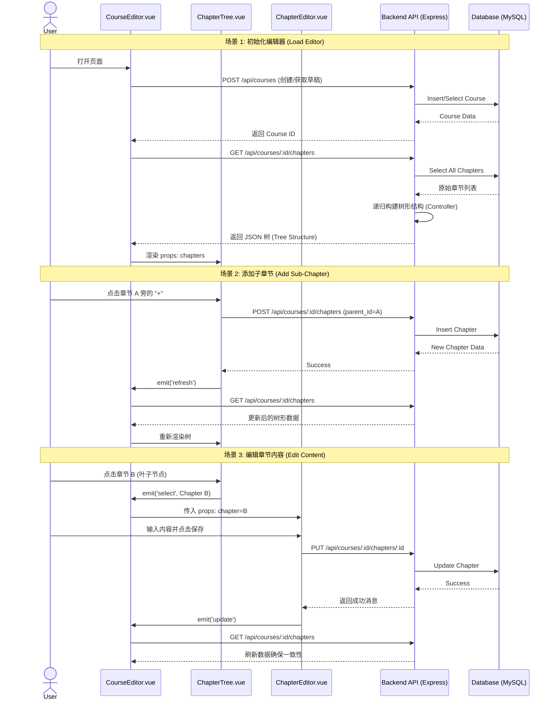

```mermaid
sequenceDiagram
    actor User
    participant View as CourseEditor.vue
    participant Tree as ChapterTree.vue
    participant Editor as ChapterEditor.vue
    participant API as Backend API (Express)
    participant DB as Database (MySQL)

    Note over User, DB: 场景 1: 初始化编辑器 (Load Editor)
    User->>View: 打开页面
    View->>API: POST /api/courses (创建/获取草稿)
    API->>DB: Insert/Select Course
    DB-->>API: Course Data
    API-->>View: 返回 Course ID
    View->>API: GET /api/courses/:id/chapters
    API->>DB: Select All Chapters
    DB-->>API: 原始章节列表
    API->>API: 递归构建树形结构 (Controller)
    API-->>View: 返回 JSON 树 (Tree Structure)
    View->>Tree: 渲染 props: chapters

    Note over User, DB: 场景 2: 添加子章节 (Add Sub-Chapter)
    User->>Tree: 点击章节 A 旁的 "+"
    Tree->>API: POST /api/courses/:id/chapters (parent_id=A)
    API->>DB: Insert Chapter
    DB-->>API: New Chapter Data
    API-->>Tree: Success
    Tree->>View: emit('refresh')
    View->>API: GET /api/courses/:id/chapters
    API-->>View: 更新后的树形数据
    View->>Tree: 重新渲染树

    Note over User, DB: 场景 3: 编辑章节内容 (Edit Content)
    User->>Tree: 点击章节 B (叶子节点)
    Tree->>View: emit('select', Chapter B)
    View->>Editor: 传入 props: chapter=B
    User->>Editor: 输入内容并点击保存
    Editor->>API: PUT /api/courses/:id/chapters/:id
    API->>DB: Update Chapter
    DB-->>API: Success
    API-->>Editor: 返回成功消息
    Editor->>View: emit('update')
    View->>API: GET /api/courses/:id/chapters
    API-->>View: 刷新数据确保一致性
```