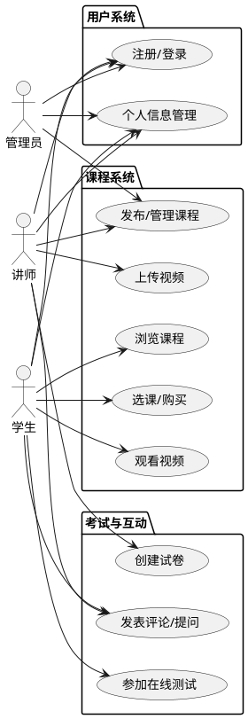
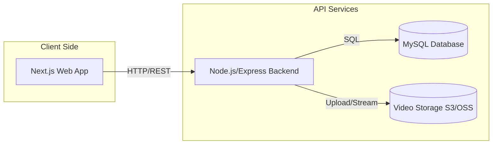
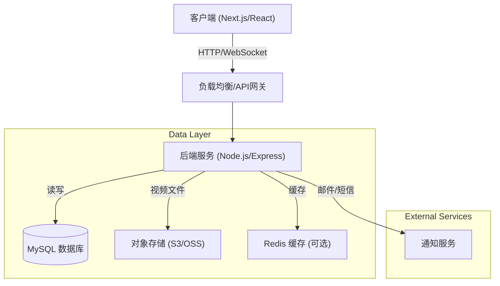
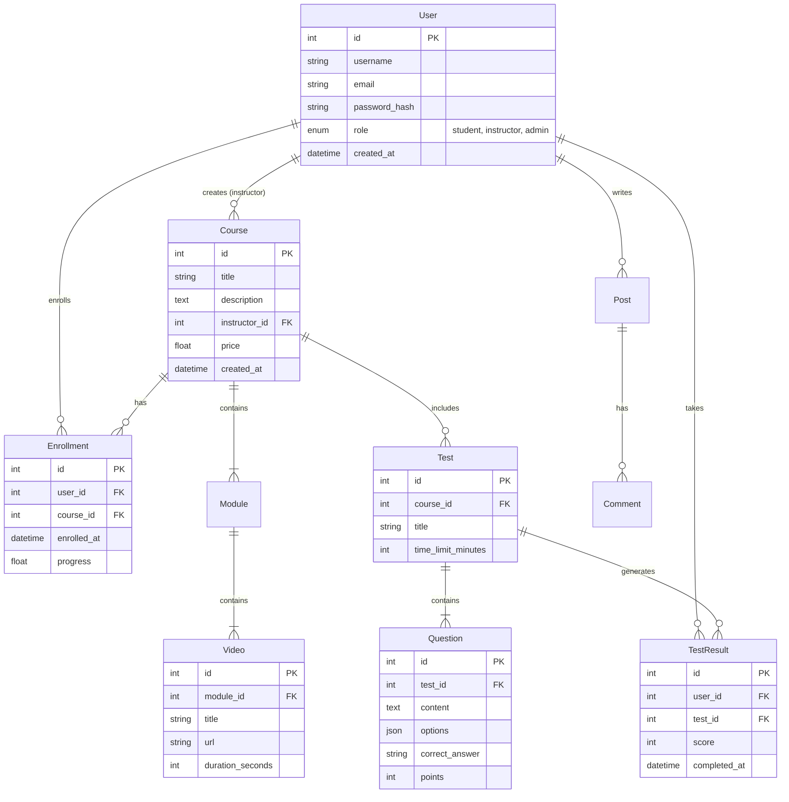
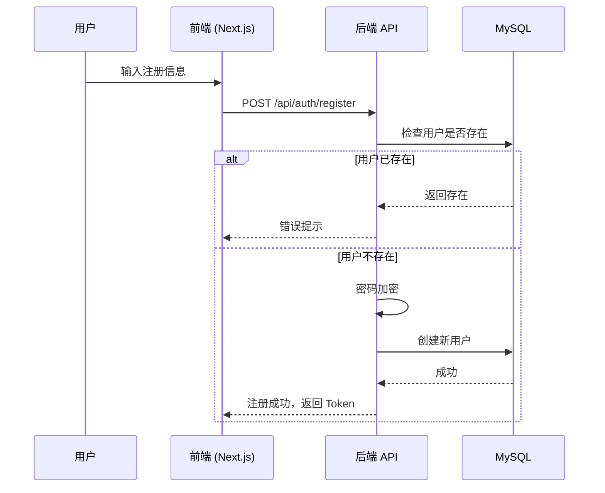
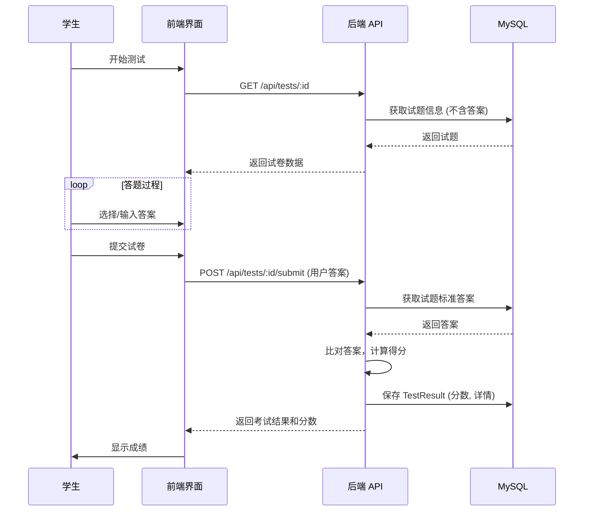

# 在线教育平台技术设计文档

## 1. 项目概述

本项目旨在开发一个功能完善的在线教育平台，为用户提供便捷的在线学习体验。

### 1.1 核心目标
- 提供视频教学、在线测试、互动讨论等核心功能。
- 构建稳定、可扩展的系统架构，支持多用户并发访问。

### 1.2 主要功能模块
1.  **用户管理**：注册、登录、角色管理（学生、讲师、管理员）、权限控制。
2.  **课程管理**：课程的增删改查、章节管理、课程发布。
3.  **视频播放**：视频上传、转码处理（可选）、流媒体播放。
4.  **在线测试**：题库管理、试卷生成、在线答题、自动评分。
5.  **社区互动**：课程评论、问答区、实时聊天/通知。

### 1.3 用例图 (Use Case Diagram)

---

## 2. 技术架构

### 2.1 技术选型
- **前端 (Frontend)**: Next.js, React
- **后端 (Backend)**: TypeScript, Node.js, Express
- **数据库 (Database)**: MySQL
- **其他**: 视频存储 (如 AWS S3 或 OSS，待定), 实时通信 (Socket.io，用于聊天)

### 2.2 系统架构图

或者使用更详细的流程图：

---

## 3. 数据库设计

### 3.1 实体关系图 (ER Diagram)

---

## 4. 核心业务流程

### 4.1 用户注册与登录

### 4.2 在线测试与自动评分

---

## 5. API 接口概览

详细接口文档请参考：
- [注册接口文档](api/register.md)
- [登录接口文档](api/login.md)

| 模块 | 方法 | 路径 | 描述 |
|---|---|---|---|
| **Auth** | POST | `/api/login` | 用户登录 |
| | POST | `/api/register` | 用户注册 |
| **Courses** | GET | `/api/courses` | 获取课程列表 |
| | GET | `/api/courses/:id` | 获取课程详情 |
| | POST | `/api/courses` | 创建课程 (讲师/管理员) |
| **Videos** | GET | `/api/videos/:id` | 获取视频播放地址 |
| **Tests** | GET | `/api/tests/:courseId` | 获取课程测试 |
| | POST | `/api/tests/:id/submit` | 提交测试答案 |

