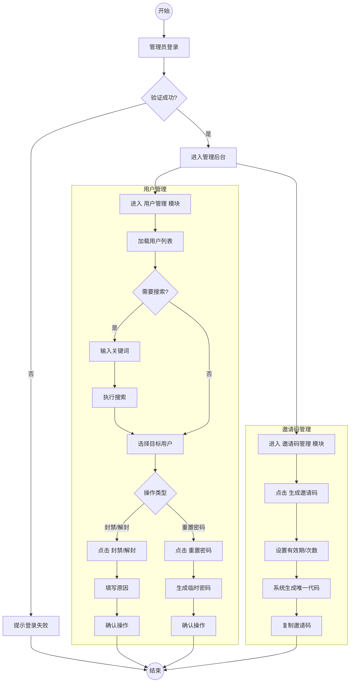
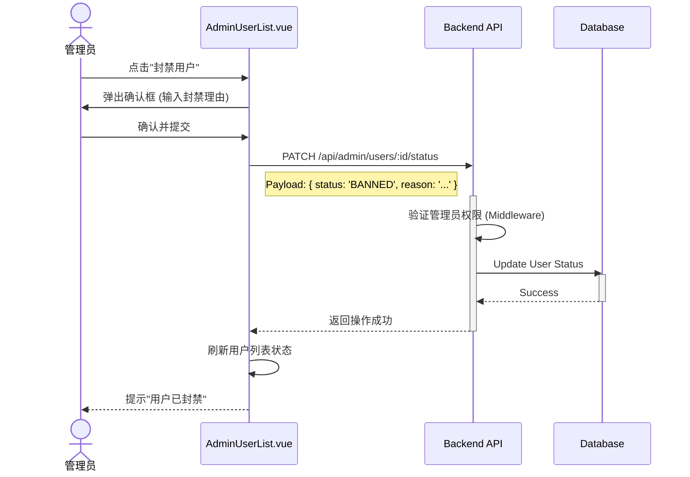
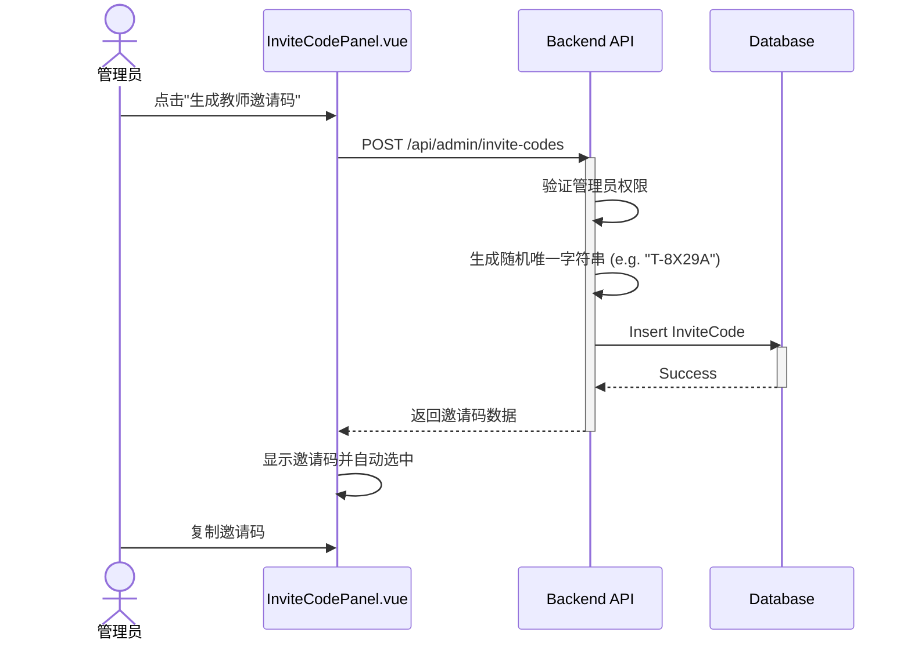

# 管理员账户与权限管理功能实现方案

## 1. 功能概述
本模块主要涉及管理员对系统用户的管理权限，包括查看用户列表、封禁/解封违规账号、重置用户密码，以及生成教师注册邀请码。超级管理员还拥有管理普通管理员账号的特权。

## 2. 业务流程设计 (Activity Diagram)

### 2.1 用户管理与邀请码生成流程

## 3. 系统交互设计 (Sequence Diagram)

### 3.1 封禁用户时序图

### 3.2 生成邀请码时序图

## 4. 实施方案 (Implementation Plan)

### 4.1 后端开发 (Node.js + Express)

#### 4.1.1 API 接口设计
| 方法 | 路径 | 描述 | 权限 |
| :--- | :--- | :--- | :--- |
| `GET` | `/api/admin/users` | 获取用户列表 (支持分页、搜索、角色筛选) | Admin, SuperAdmin |
| `PATCH` | `/api/admin/users/:id/status` | 修改用户状态 (ACTIVE/BANNED) | Admin, SuperAdmin |
| `POST` | `/api/admin/users/:id/reset-password` | 重置用户密码 | Admin, SuperAdmin |
| `POST` | `/api/admin/invite-codes` | 生成教师注册邀请码 | Admin, SuperAdmin |
| `GET` | `/api/admin/invite-codes` | 查看有效的邀请码列表 | Admin, SuperAdmin |

#### 4.1.2 数据模型调整
- **User Model**: 确保有 `status` (ACTIVE, BANNED) 和 `role` 字段。
- **InviteCode Model**: 
    - `code`: String (Unique)
    - `is_used`: Boolean
    - `created_by`: Integer (Admin ID)
    - `expires_at`: Date

#### 4.1.3 权限中间件
- 创建 `requireAdmin` 中间件，检查 `req.user.role` 是否为 `ADMIN` 或 `SUPER_ADMIN`。

### 4.2 前端开发 (Vue 3)

#### 4.2.1 页面结构
- **`views/admin/UserManagement.vue`**:
    - 搜索栏 (Search Bar)
    - 用户表格 (User Table): 展示 ID, 头像, 昵称, 邮箱, 角色, 状态, 操作列。
    - 分页控件 (Pagination)。
- **`views/admin/InviteCodeManagement.vue`**:
    - 生成按钮。
    - 历史邀请码列表 (展示是否已使用)。

#### 4.2.2 关键组件
- **`StatusBadge.vue`**: 用于展示 正常/封禁 状态的标签。
- **`ActionModal.vue`**: 通用的确认操作弹窗。

### 4.3 安全性考量
1.  **越权防护**: 必须在后端严格校验操作者是否具备管理员身份，防止普通用户通过 API 调用管理接口。
2.  **超级管理员保护**: 普通管理员不能封禁或重置超级管理员的账号。
3.  **操作日志**: 建议记录关键操作（如封禁用户）的日志，包括操作人 IP、时间、理由。

## 5. 待办任务 (Todo List)
- [ ] 后端: 创建 `adminRoutes.js` 和 `adminController.js`。
- [ ] 后端: 实现 `requireAdmin` 中间件。
- [ ] 后端: 实现用户列表查询与状态修改接口。
- [ ] 后端: 实现邀请码生成逻辑。
- [ ] 前端: 创建管理员布局 `AdminLayout.vue`。
- [ ] 前端: 实现用户管理页面与交互。
