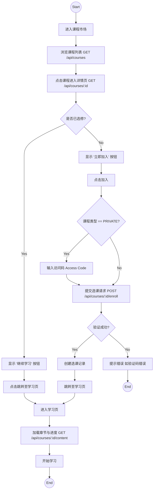
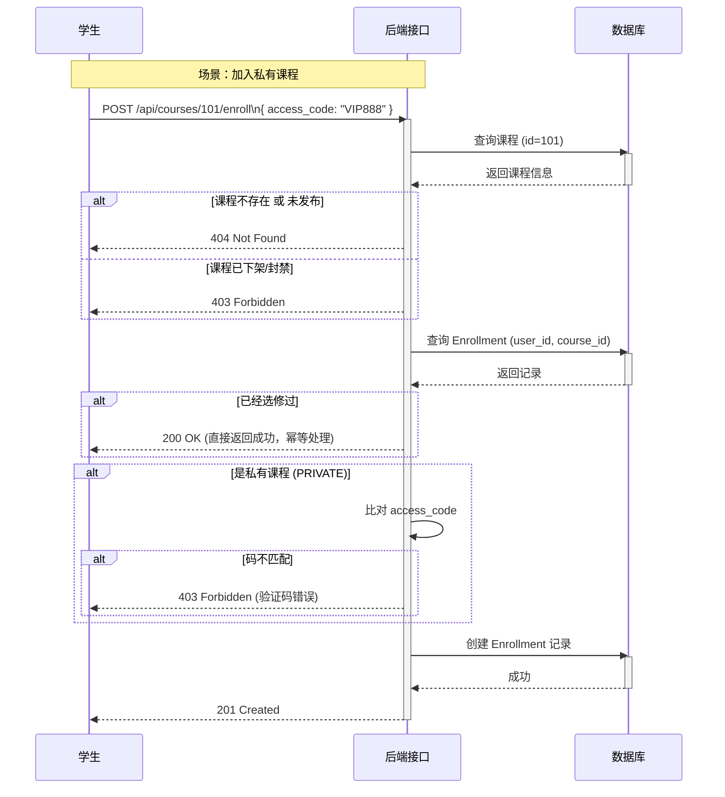

# 学生课程学习系统实施计划

本计划旨在实现学生端的课程学习全流程，将选课、学习等功能整合至统一的课程接口体系中，不再单独划分学生路由，以保持 API 结构的简洁性。

## 1. 系统概述

系统将围绕“课程”这一核心资源，扩展其在学生视角的交互能力：
1.  **课程发现**：浏览已发布的公开课程。
2.  **选课流程**：处理公开课直接加入和私有课验证加入。
3.  **学习空间**：获取已选课程的专属学习内容和进度。

## 2. 接口设计 (统一路由)

所有接口均挂载于 `/api/courses` 路径下，通过中间件区分用户角色和权限。

| 功能模块 | 方法 | URL | 描述 | 控制器 |
| :--- | :--- | :--- | :--- | :--- |
| **我的课程** | GET | `/api/courses/enrolled` | 获取当前用户已选修的课程列表 (需在 `/:id` 路由前定义) | `courseController.getEnrolledCourses` |
| **课程市场** | GET | `/api/courses` | 获取已发布的公开课程 (支持分页/搜索) | `courseController.getCourseList` |
| **课程详情** | GET | `/api/courses/:id` | 获取课程基础信息 (未选课看简介，已选课看状态) | `courseController.getCourseDetail` |
| **加入课程** | POST | `/api/courses/:id/enroll` | 学生选课 (Body 可选 `access_code`) | `courseController.enrollCourse` |
| **学习内容** | GET | `/api/courses/:id/content` | 获取课程章节树及学习进度 (仅限已选课用户) | `courseController.getCourseContent` |

> **注意**: 路由定义的顺序至关重要，`/api/courses/enrolled` 必须定义在 `/api/courses/:id` 之前，否则 `enrolled` 会被误识别为课程 ID。

## 3. 业务流程图 (Mermaid)

### 3.1 选课与学习活动图 (Activity Diagram)

### 3.2 选课时序图 (Sequence Diagram)

## 4. 数据库模型交互

主要涉及 `Enrollment` 表的操作，以及与 `Course` 和 `User` 的关联。

*   **Enrollment 表**:
    *   `student_id`: 当前登录用户 ID
    *   `course_id`: 目标课程 ID
    *   `joined_at`: 选课时间
    *   `progress`: 学习进度 (百分比或已学章节数)

## 5. 实施步骤

1.  **后端路由调整 (`courseRoutes.js`)**:
    *   在 `/:id` 之前添加 `router.get('/enrolled', ...)`。
    *   添加 `router.post('/:id/enroll', ...)`。
    *   添加 `router.get('/:id/content', ...)`。

2.  **控制器扩展 (`courseController.js`)**:
    *   新增 `getEnrolledCourses`: 查询 `Enrollment` 表并 include `Course`。
    *   新增 `enrollCourse`: 实现选课逻辑校验。
    *   新增 `getCourseContent`: 类似 `getChapters`，但可能需要附加用户的学习状态（如已学完的章节）。

