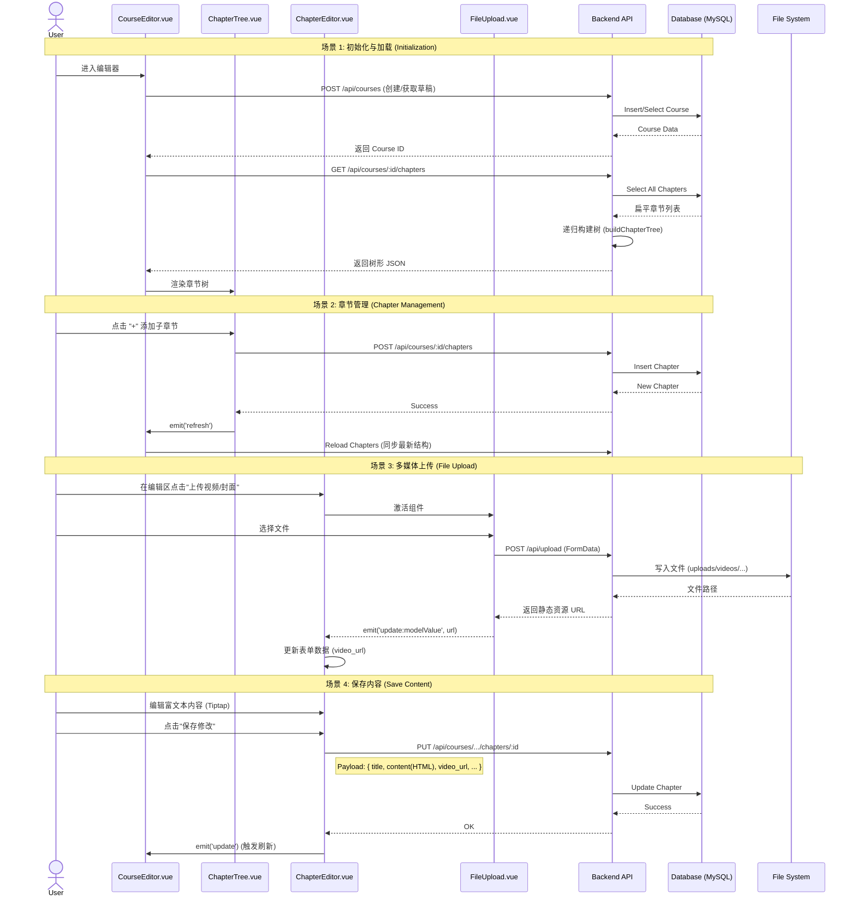

# 课程创建与编辑功能实现文档

## 1. 功能概述
本模块实现了课程的完整创建、编辑与发布流程。支持多级章节管理（树形结构）、富文本内容编辑、以及视频/图片/课件的多媒体文件上传。

## 2. 核心架构

### 2.1 前端架构 (Vue 3)
- **`CourseEditor.vue`**: 顶层容器。负责管理课程级元数据（标题、封面、状态）和章节树的整体布局。
- **`ChapterTree.vue`**: 递归组件。使用 `vuedraggable` 实现可拖拽（目前仅展示）的树形目录结构，支持无限层级（业务限制为3级）。
- **`ChapterEditor.vue`**: 章节内容编辑器。根据节点类型（文件夹 vs 文件）动态展示表单。集成 `Tiptap` 富文本编辑器。
- **`FileUpload.vue`**: 通用上传组件。封装了文件选择、进度条显示、API 调用及预览功能。

### 2.2 后端架构 (Node.js + Express)
- **`courseController.js`**: 处理课程的 CRUD 及发布逻辑。
- **`chapterController.js`**: 处理章节的增删改查。核心逻辑是 `buildChapterTree`，将扁平的数据库记录转换为树形 JSON。
- **`uploadController.js`**: 基于 `multer` 处理文件上传，按类型（image/video/file）分目录存储。

## 3. 交互流程与协作图

以下时序图展示了用户、前端组件、后端 API 与数据库/文件系统之间的交互细节。

## 4. 关键实现细节

### 4.1 树形结构处理
后端不存储树形结构，只存储 `parent_id`。
- **读取时**: 获取该课程所有章节，在内存中通过递归算法组装成树。
- **写入时**: 仅需指定 `parent_id`。
- **叶子节点逻辑**: 如果一个节点没有子节点，默认为 `FILE` 类型（可编辑内容）；一旦添加了子节点，自动视为 `FOLDER` 类型（仅作为目录）。

### 4.2 文件上传策略
- **存储**: 本地磁盘存储 (`/backend/uploads/`)。
- **命名**: `Timestamp-Random-OriginalName` 防止重名。
- **访问**: 通过 Express 的 `express.static` 中间件暴露 `/uploads` 路径。

### 4.3 富文本编辑
使用 **Tiptap** (Headless Editor)。
- **优点**: 相比 Quill 更轻量，Vue 3 支持更好，完全可定制 UI。
- **数据**: 保存为 HTML 字符串存储在数据库 `content` 字段中。

## 5. 待优化项
1.  **拖拽排序**: 目前前端使用了 `vuedraggable`，但后端尚未处理 `order` 字段的批量更新接口。
2.  **云存储**: 生产环境应将文件上传迁移至 OSS/S3。
3.  **视频转码**: 目前直接存储原文件，未做 HLS/DASH 切片处理。
