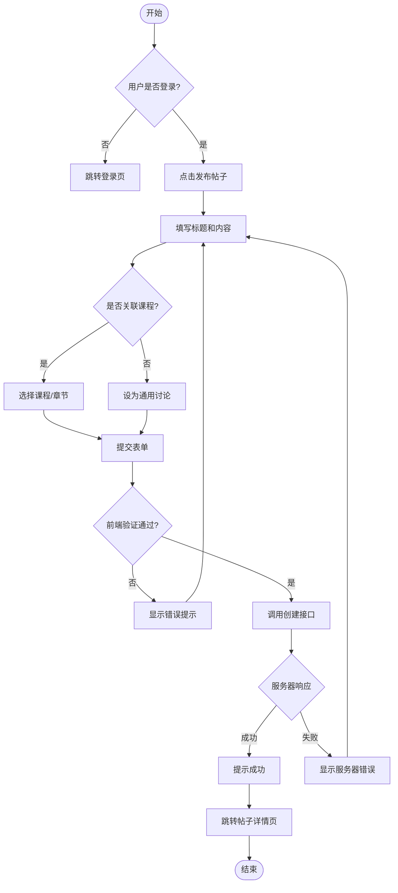
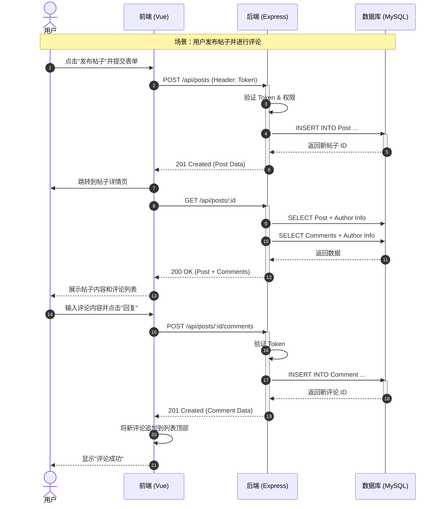

# 论坛系统开发方案 (Forum System Implementation Plan)

本文档详细描述了论坛系统（帖子与评论）的开发计划、API 设计及交互流程。

## 1. 核心功能需求

论坛系统旨在为学生和教师提供一个交流平台。
- **发帖 (Post)**: 用户可以发布讨论，帖子可以关联特定的课程或章节，也可以是通用讨论。
- **评论 (Comment)**: 用户可以对帖子进行回复。
- **查看**: 支持按课程筛选帖子，查看帖子详情及所有评论。
- **管理**: 作者可以删除自己的帖子/评论，管理员可以删除任何内容。

## 2. 数据库模型 (已存在)

基于 `database/schema.sql`，我们已经有了以下表结构：

- **Post**: `id`, `title`, `content`, `author_id`, `course_id` (可选), `chapter_id` (可选), `published`, `created_at`
- **Comment**: `id`, `content`, `author_id`, `post_id`, `created_at`

## 3. 交互流程设计 (Mermaid Diagrams)

### 3.1 用户发帖流程 (Activity Diagram)

### 3.2 帖子与评论交互时序 (Sequence Diagram)

## 4. API 接口设计

### 4.1 帖子管理 (Posts)

| 方法 | 路径 | 描述 | 权限 |
| :--- | :--- | :--- | :--- |
| `GET` | `/api/posts` | 获取帖子列表 (支持分页, `course_id` 筛选) | 公开/登录 |
| `GET` | `/api/posts/:id` | 获取单条帖子详情 (包含评论) | 公开/登录 |
| `POST` | `/api/posts` | 发布新帖子 | 登录用户 |
| `DELETE` | `/api/posts/:id` | 删除帖子 | 作者/管理员 |

### 4.2 评论管理 (Comments)

| 方法 | 路径 | 描述 | 权限 |
| :--- | :--- | :--- | :--- |
| `POST` | `/api/posts/:id/comments` | 在指定帖子下发表评论 | 登录用户 |
| `DELETE` | `/api/comments/:id` | 删除评论 | 作者/管理员 |

## 5. 前端开发任务

1.  **组件开发**:
    -   `PostList.vue`: 展示帖子列表卡片，支持搜索和筛选。
    -   `PostDetail.vue`: 帖子正文展示 + 评论区组件。
    -   `CommentEditor.vue`: 简单的富文本或纯文本输入框，用于发表评论。
2.  **页面集成**:
    -   在 `CourseEditor` 或 `CourseDetail` 中集成“课程讨论区”。
    -   创建独立的 `/forum` 路由作为全站讨论区。

## 6. 后端开发任务

1.  **Controller**: 创建 `postController.js` 和 `commentController.js` (或合并为 `forumController.js`)。
2.  **Routes**: 创建 `forumRoutes.js`。
3.  **Middleware**: 复用 `authMiddleware` 确保只有登录用户能发帖/回帖。

