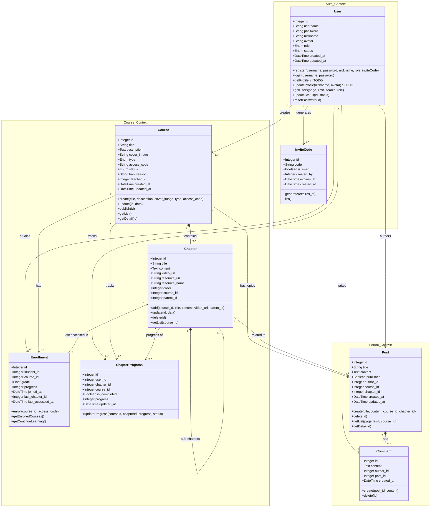

```mermaid
classDiagram

namespace Auth_Context {
    class User {
        +Integer id
        +String username
        +String password
        +String nickname
        +String avatar
        +Enum role
        +Enum status
        +DateTime created_at
        +DateTime updated_at
        +register(username, password, nickname, role, inviteCode)
        +login(username, password)
        +getProfile() TODO
        +updateProfile(nickname, avatar) TODO
        +getUsers(page, limit, search, role)
        +updateStatus(id, status)
        +resetPassword(id)
    }

    class InviteCode {
        +Integer id
        +String code
        +Boolean is_used
        +Integer created_by
        +DateTime expires_at
        +DateTime created_at
        +generate(expires_at)
        +list()
    }
}

namespace Course_Context {
    class Course {
        +Integer id
        +String title
        +Text description
        +String cover_image
        +Enum type
        +String access_code
        +Enum status
        +String ban_reason
        +Integer teacher_id
        +DateTime created_at
        +DateTime updated_at
        +create(title, description, cover_image, type, access_code)
        +update(id, data)
        +publish(id)
        +getList()
        +getDetail(id)
    }

    class Chapter {
        +Integer id
        +String title
        +Text content
        +String video_url
        +String resource_url
        +String resource_name
        +Integer order
        +Integer course_id
        +Integer parent_id
        +add(course_id, title, content, video_url, parent_id)
        +update(id, data)
        +delete(id)
        +getList(course_id)
    }

    class Enrollment {
        +Integer id
        +Integer student_id
        +Integer course_id
        +Float grade
        +Integer progress
        +DateTime joined_at
        +Integer last_chapter_id
        +DateTime last_accessed_at
        +enroll(course_id, access_code)
        +getEnrolledCourses()
        +getContinueLearning()
    }

    class ChapterProgress {
        +Integer id
        +Integer user_id
        +Integer chapter_id
        +Integer course_id
        +Boolean is_completed
        +Integer progress
        +DateTime updated_at
        +updateProgress(courseId, chapterId, progress, status)
    }
}

namespace Forum_Context {
    class Post {
        +Integer id
        +String title
        +Text content
        +Boolean published
        +Integer author_id
        +Integer course_id
        +Integer chapter_id
        +DateTime created_at
        +DateTime updated_at
        +create(title, content, course_id, chapter_id)
        +delete(id)
        +getList(page, limit, course_id)
        +getDetail(id)
    }

    class Comment {
        +Integer id
        +Text content
        +Integer author_id
        +Integer post_id
        +DateTime created_at
        +create(post_id, content)
        +delete(id)
    }
}

%% Relationships

%% User relationships
User "1" --> "0..*" Course : creates
User "1" --> "0..*" Enrollment : studies
User "1" --> "0..*" ChapterProgress : tracks
User "1" --> "0..*" Post : authors
User "1" --> "0..*" Comment : writes
User "1" --> "0..*" InviteCode : generates

%% Course relationships
Course "1" *-- "0..*" Chapter : contains
Course "1" --> "0..*" Enrollment : has
Course "1" --> "0..*" ChapterProgress : tracks
Course "1" --> "0..*" Post : has topics

%% Chapter relationships
Chapter "1" *-- "0..*" Chapter : sub-chapters
Chapter "1" --> "0..*" ChapterProgress : progress of
Chapter "1" --> "0..*" Post : related to
Chapter "1" <-- "0..*" Enrollment : last accessed in

%% Forum relationships
Post "1" *-- "0..*" Comment : has
```